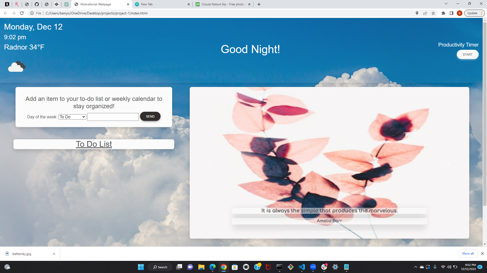
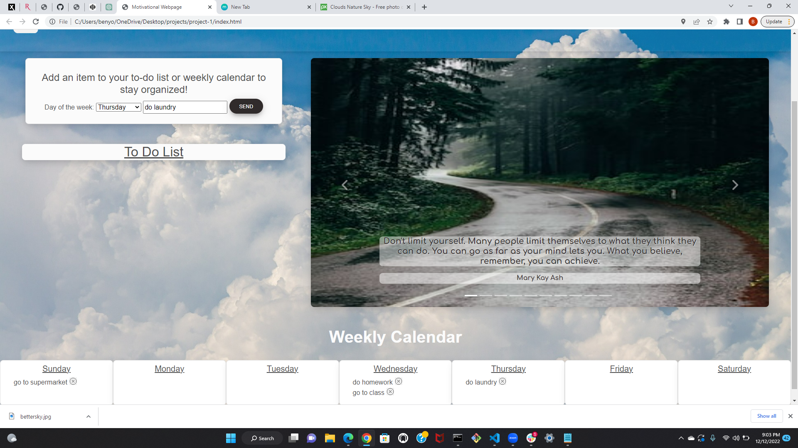
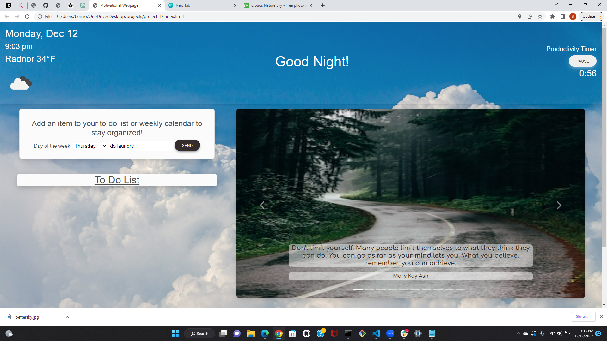
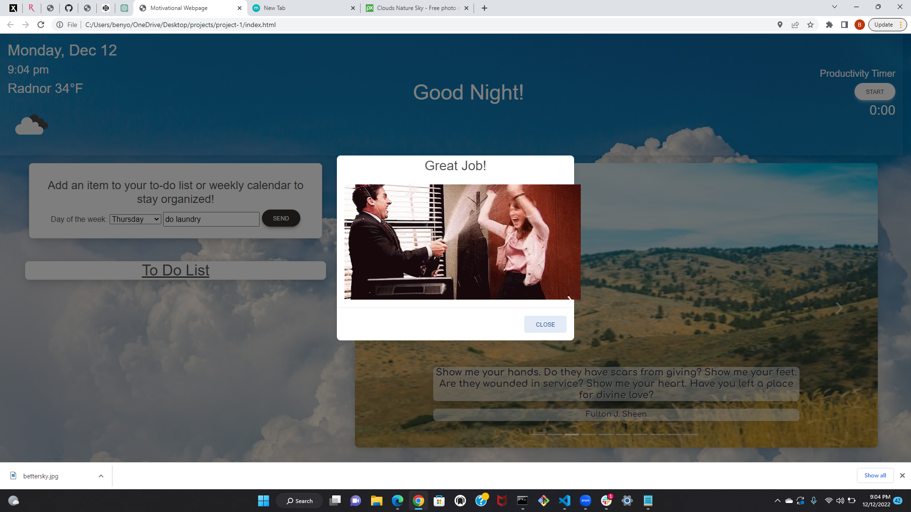

# Motivational Calendar

## Description

This application is a task manager that organizes the user's weekly tasks by day of the week. The application has features to keep the user focused and motivated. There is a productivity timer that is set for an hour to hold the user accountable to stay focused for that period of time. When the timer ends, there is a modal that appears with a semi-randomized gif to congratulate the user for staying focused. There is also a section of the page which contains motivational quotes and calming nature photos to motivate and inspire the user. The webpage also features a task organizer that allows the user to input tasks into a weekly calendar or a general to-do list. The tasks the user inputs are saved for future reference and can be deleted as tasks are completed. The purpose of this application is to help the user organize their work schedule in order to optimize their productivity. We learned how to work with Git and Github on the same project as a group and applied the material covered in the first portion of our class in our application. 

## Installation

This application requires no installation and can be accessed on most web browsers at https://val-gee.github.io/project-1/.

## Usage

To use the calendar, input the task you want to schedule and select from either the To Do list or one of the days of the week. Click send and your entry will be saved and posted to the page. To delete a task, click the delete button next to it.

To use the productivity timer, click the Start button. To pause, click the same button again. To restart the timer, click again. When the timer ends, a modal will appear with a gif. To close the modal, click the Close button on the bottom.

To user the quote carousel, simply click the arrows on either side of the carousel to navigate from quote to quote. To go to a specific slide in the carousel, the user can click one of the flat ___ icons at the bottom of the carousel. 

## Credits

Created by Jung Dettelback, Valentina Guevara, Patrick Morris, and Ben Yomtov

APIs used: 

OpenWeather https://openweathermap.org/api
Day.js https://day.js.org/
Giphy https://developers.giphy.com/
API Ninjas https://api-ninjas.com/

MDBootstrap was used to style this application. https://mdbootstrap.com/

Images sourced from https://unsplash.com/ and https://pixabay.com/photos/clouds-nature-sky-cumulus-weather-4215608/

## License

No License.
